# 气态巨行星拓展

[点此订阅](https://mods.paradoxplaza.com/mods/83350/Any)

群星(Stellaris) Mod，使玩家可以改造并殖民气态巨行星

新增一个**飞升**，允许玩家环境改造并殖民**气态巨行星**

行星拥有**所有区划类型**，区划数量只受行星规模限制，且可以逐步升级为高级区划。

因区划类型过多，原版UI显示不完全，所以需要有UI Mod支持，比如[UI Overhaul Dynamic](https://mods.paradoxplaza.com/mods/1166/Any)

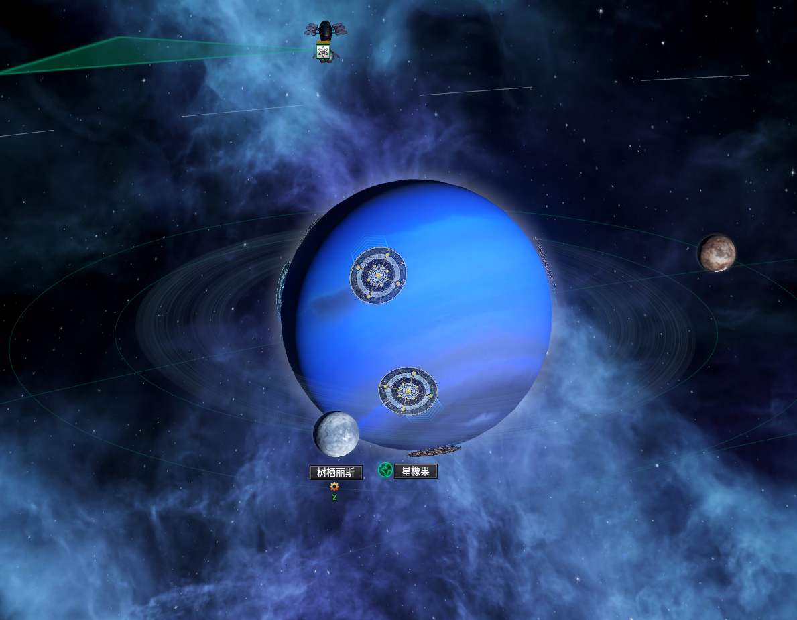

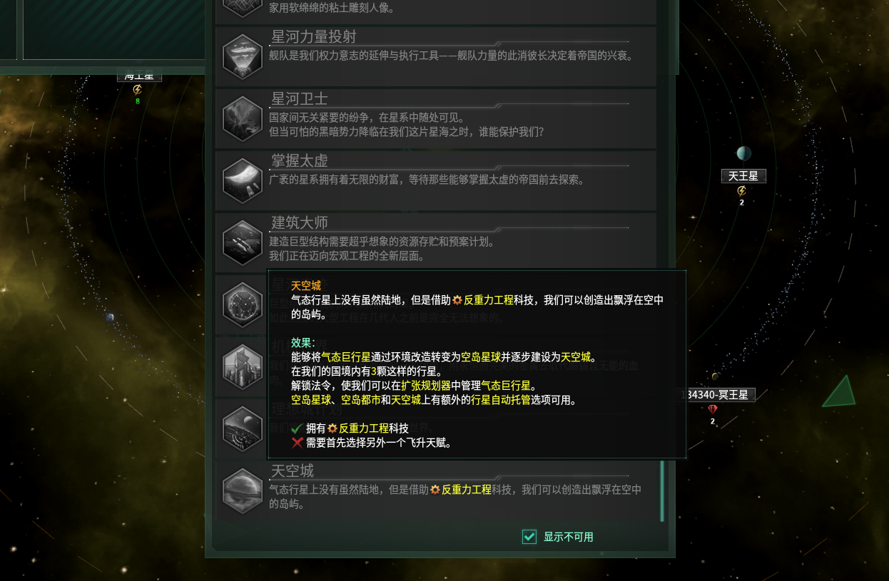

可通过`法令`标记气态行星以便在`扩张规划器`中管理

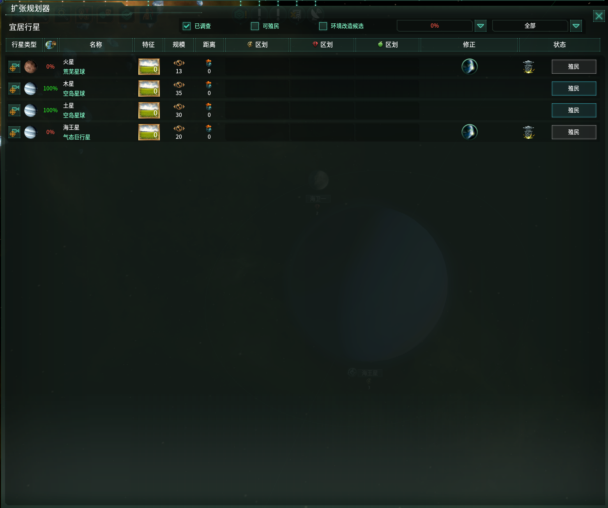

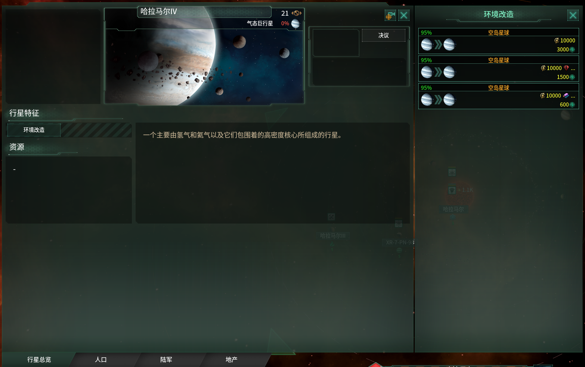

可升级行星以解锁高级区划

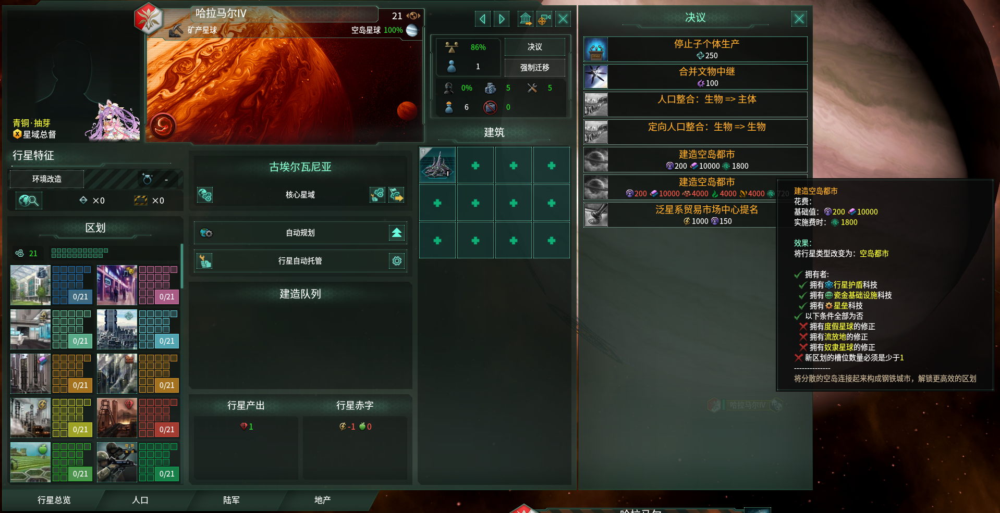

铸造和工业区划支持根据**殖民地规划**类型提供不同的岗位，升级后的铸造和工业区划**不支持**此功能

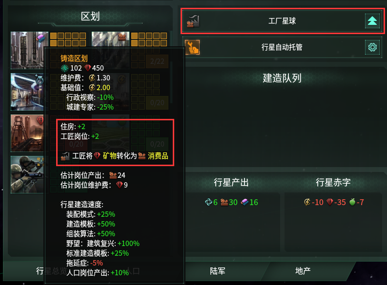

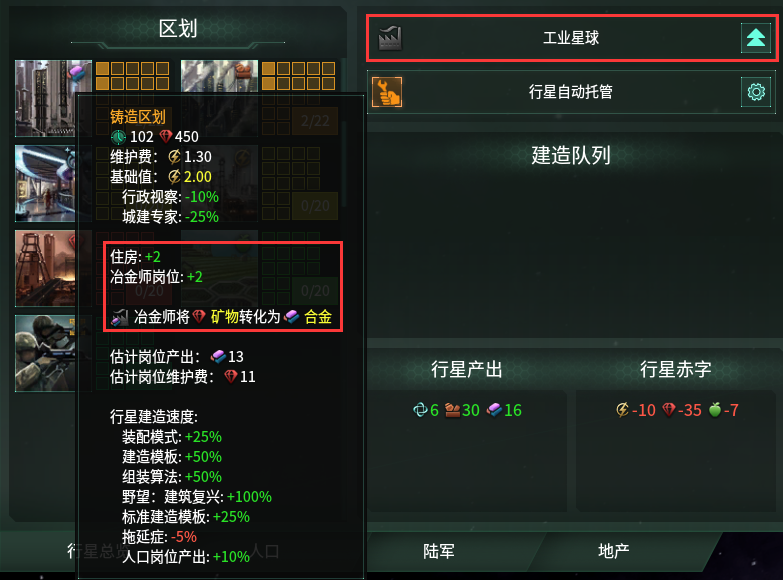

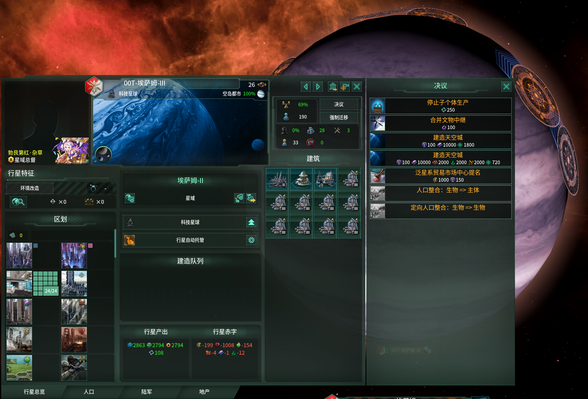

升级到最高级会解锁行政管理区划，提供**行政管理能力**以增加**帝国规模上限**

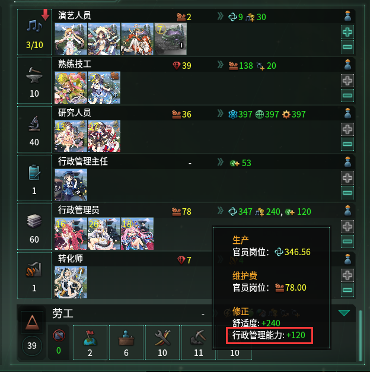

最高级的区划拥有产出加成，并在大量建设同类型区划时提供额外效果

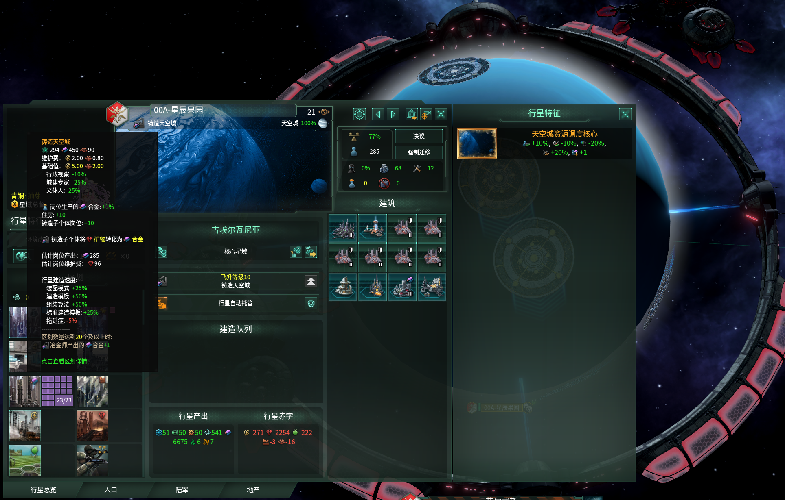

部分区划只需要少量建设即可拥有额外效果

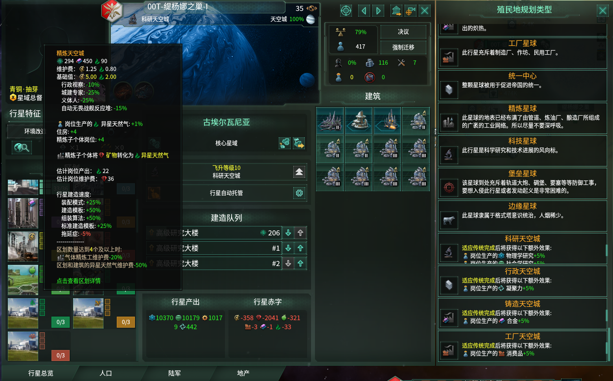

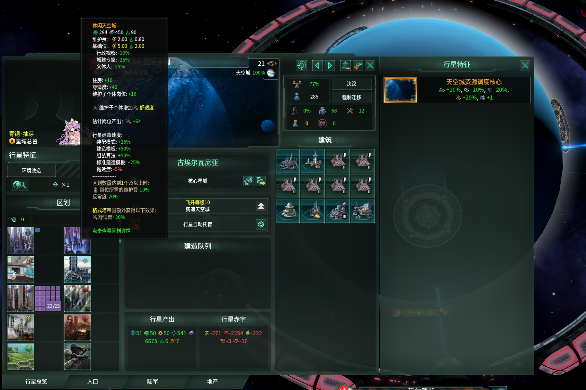

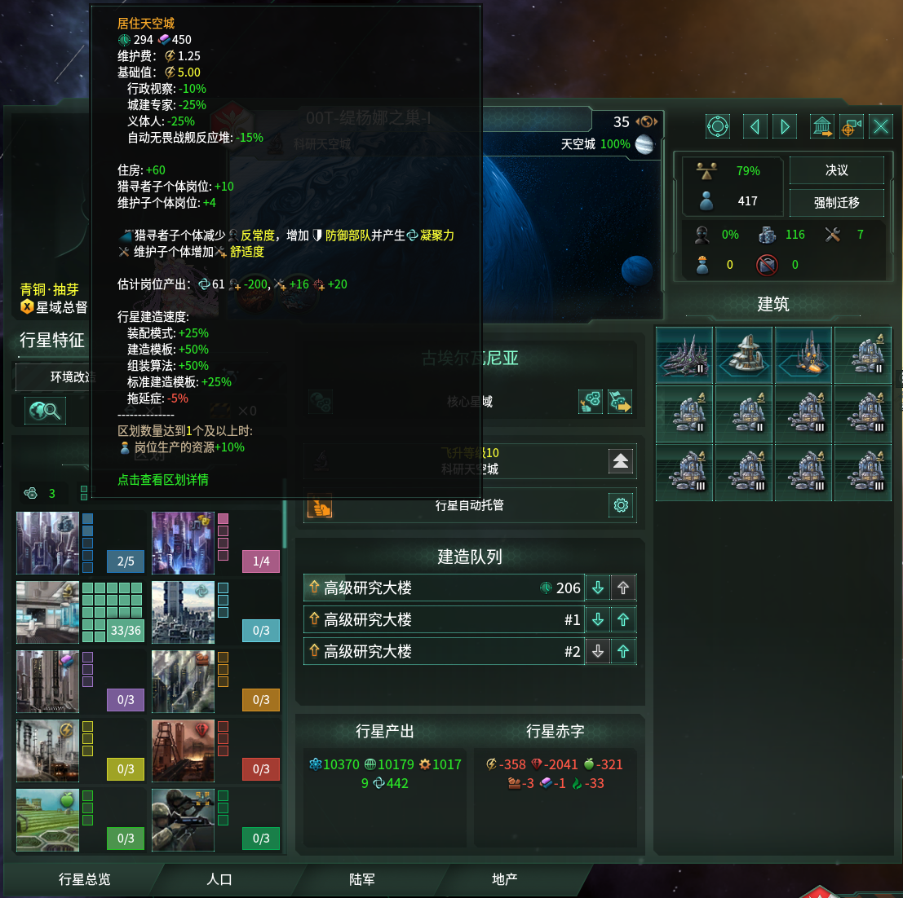
